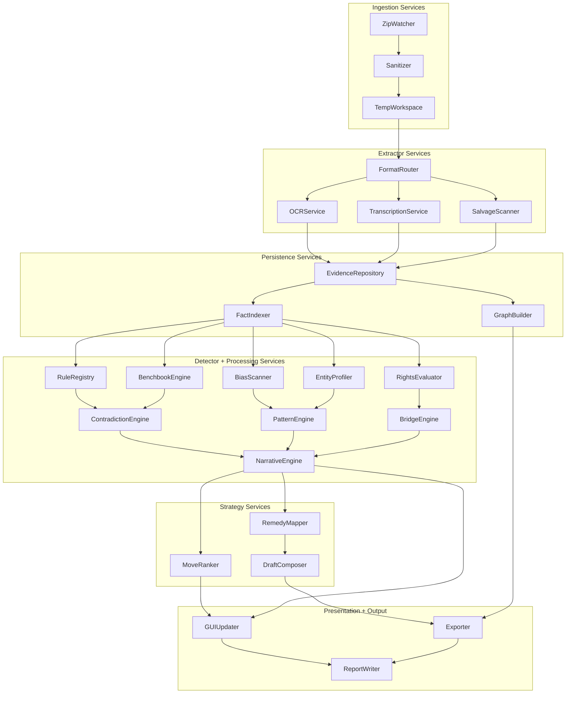

# Litigation OS Evidence Superstructure Architecture

This document captures the system-level dataflow and module interaction map for the Evidence→Violation→Remedy engine. It is the reference point for implementing the Python backbone and verifying GUI.exe integration points.

## Layered Pipeline Overview

1. **Ingestion Layer** – watches the `F:/` drive, acquires archives, sanitizes entries, and orchestrates staged extraction.
2. **Extraction & Salvage** – decompresses, converts, and salvages textual payloads in parallel before persisting artifacts.
3. **Evidence Store** – persists canonical exhibits, facts, violations, and graph relationships with provenance metadata.
4. **Violation Detector Matrix** – evaluates normalized facts against procedural, statutory, and behavioral rulesets.
5. **Processing Layer** – expands the litigation narrative through contradiction checks, pattern recognition, and bridge building.
6. **Strategy & Remedy Generator** – maps violations to court-ready actions, recommended filings, and prioritization scores.
7. **Visualization & Output** – feeds GUI.exe dashboards and produces export artifacts for filings and analytics.

## Evidence→Violation→Remedy Dataflow

```mermaid
flowchart TD
    subgraph Intake[Ingestion Layer]
        W[ZIP Watcher\nF:/ Poller]
        ZI[Zip Intake Module\n(sanitize + quota checks)]
        EP[Extraction Pipeline\n(temp workspace)]
    end

    subgraph Extractors[Extraction & Salvage]
        PDF[pdftotext | mutool]
        DOCX[DOCX XML Extractor]
        TXT[Plaintext Reader]
        IMG[Tesseract OCR]
        AUD[Whisper Transcriber]
        BYTES[Byte Stream Scanner]
    end

    subgraph Store[Evidence Store]
        ES[(evidence table)]
        FS[(facts table)]
        VS[(violations table)]
        GS[(graph_edges table)]
    end

    subgraph Detectors[Violation Detector Matrix]
        MCR[MCR/MCL Rule Engine]
        Bench[Benchbook Compliance]
        Canon[Canon Violation Detector]
        Rights[Rights Matrix]
        Entity[Entity Behavior Tracker]
    end

    subgraph Processing[Context Expansion]
        Contra[Contradiction Finder]
        Pattern[Pattern Amplifier]
        Bridge[Cross-Case Bridge]
        Narrative[Narrative Engine]
    end

    subgraph Strategy[Strategy & Remedy]
        Map[Violation → Remedy Map]
        Draft[Draft Filing Generator]
        Next[Next Best Move Engine]
    end

    subgraph GUI[Visualization]
        Timeline[Timeline Warboard]
        Matrix[Violation Matrix]
        Graph[Entity Graph]
        Remedy[Remedy Panel]
    end

    subgraph Output[Deliverables]
        Report[Violations_Report.md]
        JSONL[violations.jsonl]
        CSV[Timeline.csv]
        GraphML[Litigation_Graph.graphml]
        Docx[Draft_Filings/]
    end

    W --> ZI --> EP
    EP --> PDF
    EP --> DOCX
    EP --> TXT
    EP --> IMG
    EP --> AUD
    EP --> BYTES

    PDF --> ES
    DOCX --> ES
    TXT --> ES
    IMG --> ES
    AUD --> ES
    BYTES --> ES
    ES --> FS

    FS --> MCR
    FS --> Bench
    FS --> Canon
    FS --> Rights
    FS --> Entity

    MCR --> VS
    Bench --> VS
    Canon --> VS
    Rights --> VS
    Entity --> VS

    VS --> Contra
    VS --> Pattern
    FS --> Contra
    FS --> Pattern
    FS --> Bridge
    VS --> Bridge
    Bridge --> Narrative
    Pattern --> Narrative
    Contra --> Narrative

    Narrative --> Map
    VS --> Map
    Map --> Draft
    Map --> Next
    Narrative --> Next

    Next --> Timeline
    Next --> Remedy
    Narrative --> Timeline
    VS --> Matrix
    GS --> Graph

    Timeline --> Output
    Matrix --> Output
    Graph --> Output
    Remedy --> Docx
    Draft --> Docx
    Map --> Report
    VS --> JSONL
    FS --> CSV
    GS --> GraphML
```

## Module Interaction Map



## Core Data Contracts

| Object | Required Fields | Produced By | Consumed By |
| --- | --- | --- | --- |
| `ZipIngestEvent` | `path`, `hash`, `discovered_at`, `sanitized_manifest` | Zip Watcher | Extraction Pipeline |
| `EvidenceItem` | `evidence_id`, `source_zip`, `original_path`, `normalized_path`, `media_type`, `text_payload`, `binary_pointer`, `ocr_confidence`, `salvage_flag` | Extractor Services | Evidence Repository, Fact Indexer |
| `FactRecord` | `fact_id`, `evidence_id`, `text`, `tokens`, `page_reference`, `timestamp`, `entities`, `location`, `confidence` | Fact Indexer | Detector Matrix, Graph Builder |
| `ViolationRecord` | `violation_id`, `fact_ids`, `rule_id`, `severity`, `confidence`, `trigger_metadata`, `remedy_refs` | Detector Matrix | Processing Layer, Strategy Layer |
| `GraphEdge` | `edge_id`, `source_node`, `target_node`, `edge_type`, `fact_ids`, `violation_ids`, `weight` | Graph Builder | GUI Entity Graph, Output Exporters |
| `RemedyAction` | `action_id`, `violation_id`, `motion_template`, `statutory_citations`, `filing_deadline`, `priority_score`, `next_steps` | Strategy Layer | GUI Remedy Panel, Draft Composer |

## Interface Guidelines

* **Extractor Service Contract**
  * `extract(zip_event: ZipIngestEvent, member: ZipMember) -> EvidenceItem`
  * Each extractor runs in isolation with timeouts and crash recovery hooks.
  * Failed extractions emit `EvidenceItem` with `salvage_flag=True` to keep partial data.

* **Evidence Repository API**
  * `store_evidence(item: EvidenceItem) -> None`
  * `iterate_facts(evidence_id: str) -> Iterable[FactRecord]`
  * `upsert_fact(record: FactRecord) -> None`
  * `record_violation(entry: ViolationRecord) -> None`

* **Detector Registration**
  * Detectors register through `register_detector(detector: Callable[[FactRecord], Iterable[ViolationRecord]])`.
  * Registry orchestrates batching, dependency ordering, and stateful detectors (e.g., cross-document comparisons).

* **Strategy Layer Hooks**
  * `generate_remedies(violations: Sequence[ViolationRecord], context: NarrativeBundle) -> List[RemedyAction]`
  * `compose_draft(remedy: RemedyAction) -> DraftDocument`
  * `score_next_moves(remedies: List[RemedyAction]) -> PrioritizedQueue`

* **GUI Update Bus**
  * Publish/subscribe channel where Narrative Engine, Move Ranker, and Graph Builder emit structured payloads.
  * GUI.exe subscribes to: `timeline.update`, `violation.matrix.update`, `entity.graph.update`, and `remedy.panel.update` topics.

## Integration Touchpoints

* **GUI.exe** pulls data from the update bus and REST-style adapters exposed by the Strategy Layer. Timeline and Matrix views remain synchronized by consuming identical narrative bundles with different projections.
* **Output Writers** share a rendering toolkit that transforms `NarrativeBundle`, `ViolationRecord`, and `RemedyAction` objects into Markdown, CSV, GraphML, and DOCX outputs. Hashing hooks ensure tamper-evident deliverables.
* **Self-Healing Protocol** instruments every stage with retry queues and error metrics, guaranteeing salvage logging without blocking the ingestion schedule.

## Implementation Roadmap

1. Finalize Python package skeletons mirroring the services defined above.
2. Define pydantic/dataclass models for each data contract and register them inside `codex_manifest`.
3. Implement ingestion orchestrator with pluggable extractors and metrics.
4. Wire the Detector Registry with JSON-defined rulesets and cross-case caches.
5. Expose publish/subscribe adapters so GUI.exe and automation scripts can react to new violations immediately.

This architecture map is the baseline reference for coding the Litigation OS backbone and ensures each subsystem aligns with the litigation strategy lifecycle.
